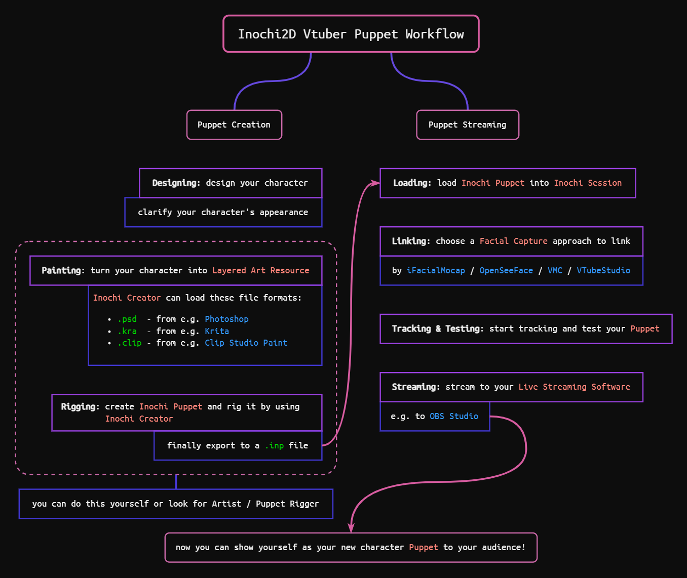

About Inochi Session
====================

.. figure:: https://user-images.githubusercontent.com/7032834/181119161-f83e8e57-2f9e-409f-90bd-1b1b9c047bcc.png
   :alt: the preview of Inochi Session

   `Aka (example
   model) <https://github.com/Inochi2D/example-models#aka>`__ by
   `seagetch <https://twitter.com/seagetch>`__

Main Purpose
------------

**Inochi Session** is an open source software which **link** your **facial expressions and body posture information** to **Inochi Puppet**, make the puppet synchronize with you and vividly express your current status in real life in real-time.

.. admonition:: In a hurry?
   :class: custom

   .. container:: ada-block

      .. image:: /img/ada-think.png
         :class: ada
         :align: left
         :width: 128px
    
      You can directly turn to :doc:`Typical Workflow step-by-step Tutorial </session/typical-workflow>` to get started quickly.

      Feel free to take a look at the rest, which might help you **understand more clearly**.

----

Quick Overview
--------------

If you want to quickly understand **the workflow of Vtube with Inochi2D**, then the typical workflow diagram may help:

As you can see, **Inochi Session** is used for **Puppet Streaming** in the workflow (right side of the diagram).

.. note::
   .. container:: ada-block

      .. image:: /img/ada-think.png
         :class: ada
         :align: left
         :width: 128px
    
      For the current version of **Inochi Session**: 
      
      -  **Facial capture** is achieved by connecting to **external facial capture software**, but it looks like there are plans to integrate it internally. 

      -  Only supports **Inochi Puppet** as the model which can be created by **Inochi Creator**.

Learn more
~~~~~~~~~~

This process is mainly based on a technology called **facial capture**.

Generally speaking, it can be understood that the computer “*sees*” you through some kind of **video camera device**, analyzes the **video stream** and converts it into **a series of parameters that can express your status** (which set up a kind of **mapping relationship** to your **Inochi Puppet**).

.. tip:: 
   .. container:: ada-block

      .. image:: /img/ada-think.png
         :class: ada-right
         :align: right
         :width: 128px
    
      This process maintaining a **mapping relationship** between you and your **Inochi Puppet** continuously, we call it **Tracking**, as you can see in **Inochi Session**\ ’s User Interface.

----

Features
--------

to be added…
