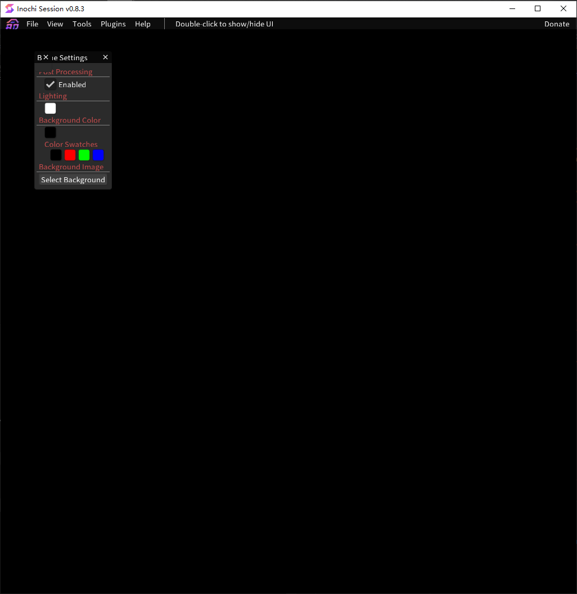

Getting started
===============

System Requirements
-------------------

To run **Inochi Session**, your system hardware must meet at least the following **Minimum** requirements:

.. list-table:: 
    :header-rows: 1
    :stub-columns: 1

    * -
      - Minimum
      - Recommended
    * - Processor
      - x86_64 or ARM64 CPU [#req_cpu]_
      - Recent x86_64 or ARM64 CPU [#req_cpu]_
    * - Memory
      - 512 MB
      - ≥ 1 GB
    * - Disk Space
      - ≥ 100 MB [#req_space]_
      - ≥ 500 MB [#req_space]_
    * - Graphics Processor
      - OpenGL 3.2 Support [#req_gl]_, 512 MB VRAM
      - OpenGL 3.2 Support [#req_gl]_, ≥ 1 GB VRAM
    * - Display Resolution (Pixels)
      - 960 × 800 
      - ≥ 1920 × 1080

**Inochi Session** does not support 32-bit systems currently to reduce the maintenance burden.

Get **Inochi Session**
----------------------

There are 2 types of release available, you can get **Inochi Session** corresponding to your Operating System via the link below.

Generally, for **Windows** and **Linux**, it is a ``.zip`` archive, for **macOS**, it is a ``.dmg`` file.

**Stable (recommended)**
~~~~~~~~~~~~~~~~~~~~~~~~

Having better stability, but it lacks behind in features with Nightly.

**Available to download on**:

-  `Our Website <https://inochi2d.com/>`__
-  `Itch.io <https://lunafoxgirlvt.itch.io/inochi-session>`__
-  `GitHub <https://github.com/Inochi2D/inochi-session/releases/latest>`__

**Nightly**
~~~~~~~~~~~

built by GitHub from the latest code every night, this means it has the latest features, but also the latest bugs.

**Available to download on**:

-  `GitHub <https://github.com/Inochi2D/inochi-session/releases/tag/nightly>`__

.. danger::
   .. compound::

      .. image:: /img/ada-warning.png
         :class: ada
         :align: left
         :width: 128px
    
      Nightly builds are not stable, we really don't recommend using them unless you know what you're doing. Nightly builds are likely to crash and can corrupt your files in the process!

      Make frequent backups!

First Time Setup
----------------

For **Windows** and **Linux**, it is provided as portable application, just simply extract the ``.zip`` file to a folder, then you can find the executable main program in it.

For **macOS**, you can install the ``.dmg`` file to your ``Applications`` folder.

Run
~~~

Run the executable program and you will see the main window:

.. note::
   .. container:: ada-block

      .. image:: /img/ada-think.png
         :class: ada-right
         :align: right
         :width: 128px
    
      Since the application is under heavy development, for the current version, known issues:

   -  Seems all the Panel will be stacked to the left top corner in a minimal state. You can drag to move and rearrange them manually.

   -  The main window may have display issues when launching from a scale higher than 100% or a multi-monitor environment

-------------

All set! You can download Example Models (**Inochi Puppet**) from `Itch.io <https://lunafoxgirlvt.itch.io/inochi-session>`__, and turn to :doc:`Typical Workflow step-by-step Tutorial </session/typical-workflow>` to quickly familiarize yourself with the basic usage. 

User Interface Reference
------------------------

To be added…

Notes
-----

.. [#req_cpu] *x86_64 and ARM64 refers to 64-bit CPUs by ARM, Intel and AMD.*

.. [#req_space] *Disk Space requirements depend on the size and amount of models you have on your system.*

.. [#req_gl] *OpenGL 3.2 is supported on the following GPUs:*
    
    - Gen 6 or later Intel HD Graphics on Linux and macOS
    - Gen 7 or later Intel HD Graphics on Windows
    - Nvidia GeForce 8 series or later
    - AMD Radeon HD 2000 series or later (marketed as TeraScale 1)
    - Apple Silicon M1 or later (OpenGL 3.1 with required extensions)

    VRAM requirements depend on the size of the model and texture count.

.. [#ui_nomac] *You will not see the UI scaling option on macOS*

    *This is intentional, UI Scaling is handled by the operating system on systems running macOS,
    To change the UI Scaling, open the system settings and change the UI scaling there.*
